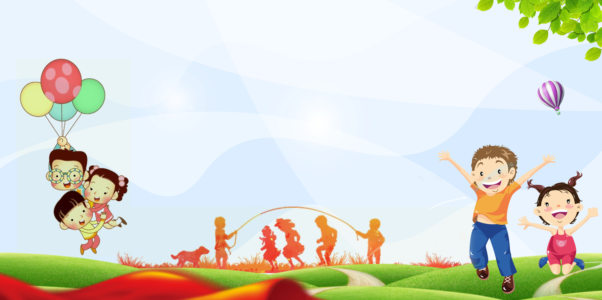

# 🎮 Math Adventures – Interactive Math Practice Game for Kids

> A fun, colorful, and interactive web-based math learning game designed to help young learners practice basic arithmetic through gamification, animations, audio feedback, and visual hints.



---

## 📖 Overview

**Math Adventures** is an educational web application built using **HTML, CSS, and JavaScript**. It allows children to practice:

- ➕ Addition
- ➖ Subtraction
- ✖️ Multiplication
- ➗ Division
- 🎲 Random Mixed Questions

The game motivates learners using scores, streaks, stars, celebrations, mascot reactions, sound effects, and interactive hints.

---

## ✨ Features

### 🎯 Multiple Math Operations
- Addition
- Subtraction
- Multiplication
- Division
- Random Mode

### 🎮 Gamification
- ⭐ Score system
- 🔥 Winning streak tracker
- 🌟 Star rewards
- 🎉 Confetti celebration
- Green success flash

### 🦁 Interactive Mascot
- Friendly mascot reactions
- Motivational speech bubbles
- Celebrates correct answers
- Encourages incorrect answers

### 💡 Smart Hint System
Provides visual and contextual hints such as:

- 🍎 Apple counting for addition
- 🍪 Cookie examples for subtraction
- 🍭 Repeated groups for multiplication
- 🎈 Equal sharing for division

### 🔊 Audio Feedback
- Correct answer sounds
- Alternate celebration sounds
- Wrong answer sounds
- Encouraging feedback

### 📱 Responsive Design
- Desktop
- Tablet
- Mobile Friendly

---

## 🛠 Technologies Used

- HTML5
- CSS3
- JavaScript (Vanilla)

---

## 📂 Project Structure

```
Math-Adventures/
│
├── index.html
├── styles.css
├── app.js
├── bg-kids.jpg
├── lion.png
├── correct.mp3
├── correct2.mp3
├── wrong.mp3
├── wrong2.mp3
└── README.md
```

---

## 🚀 Getting Started

### 1. Clone the repository

```bash
git clone https://github.com/yourusername/math-adventures.git
```

### 2. Open the project

Launch the game:
Simply double-click or open index.html in any web browser.

Alternatively, play directly online at [cymrc.github.io/MathForKids.](https://cymrc.github.io/MathForKids/)

---

## 🎮 How to Play

1. Select a math operator.
2. Solve the generated equation.
3. Enter your answer.
4. Click **CHECK**.
5. Earn points, stars, and maintain your streak.
6. Use **Hint** if you need help.
7. Click **GENERATE** for a new problem.

---

## 🎨 Highlights

- Modern colorful UI
- Kid-friendly design
- Glassmorphism cards
- Responsive layout
- Animated mascot
- Floating background decorations
- Confetti effects
- Bounce and shake animations
- Audio rewards
- Accessible controls
- Keyboard support (Press **Enter** to submit)

---

## 📸 Preview


---

## 🎯 Learning Objectives

This project helps children improve:

- Basic arithmetic skills
- Mental math
- Problem-solving
- Number recognition
- Confidence through positive reinforcement

---

## 🔮 Future Improvements

- ⏱ Timer Mode
- 🏆 Leaderboard
- 👤 Student Profiles
- 🌙 Dark Mode
- 🎖 Achievement Badges
- 📊 Progress Analytics
- 🎵 Background Music
- 🌍 Multiple Languages
- 📚 Difficulty Levels

---

## 👨‍💻 Author

Developed as an educational interactive web application for young learners.

---

## 📜 License

This project is open-source and available under the **MIT License**.

---

## ❤️ Acknowledgements

Created with the goal of making learning mathematics fun, engaging, and interactive for children.

## Live 
If you want to visit it
https://cymrc.github.io/MathForKids/
